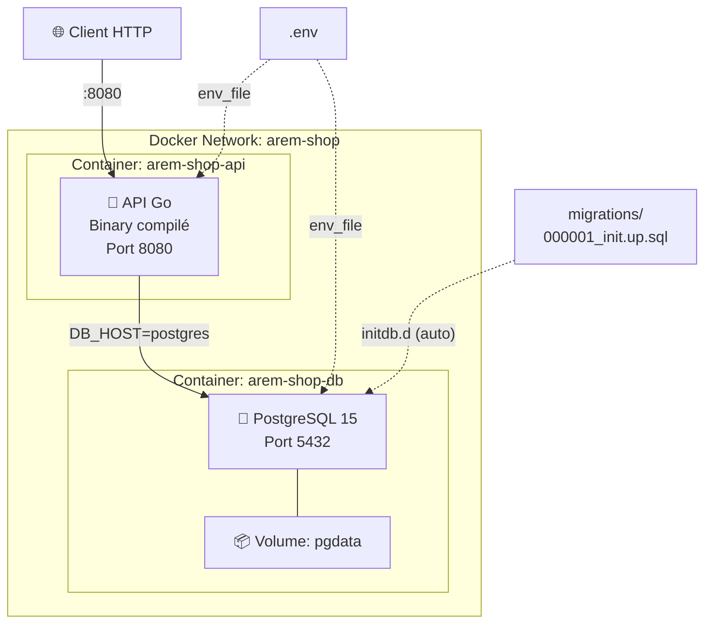
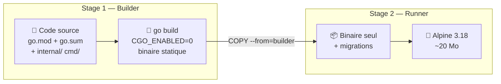
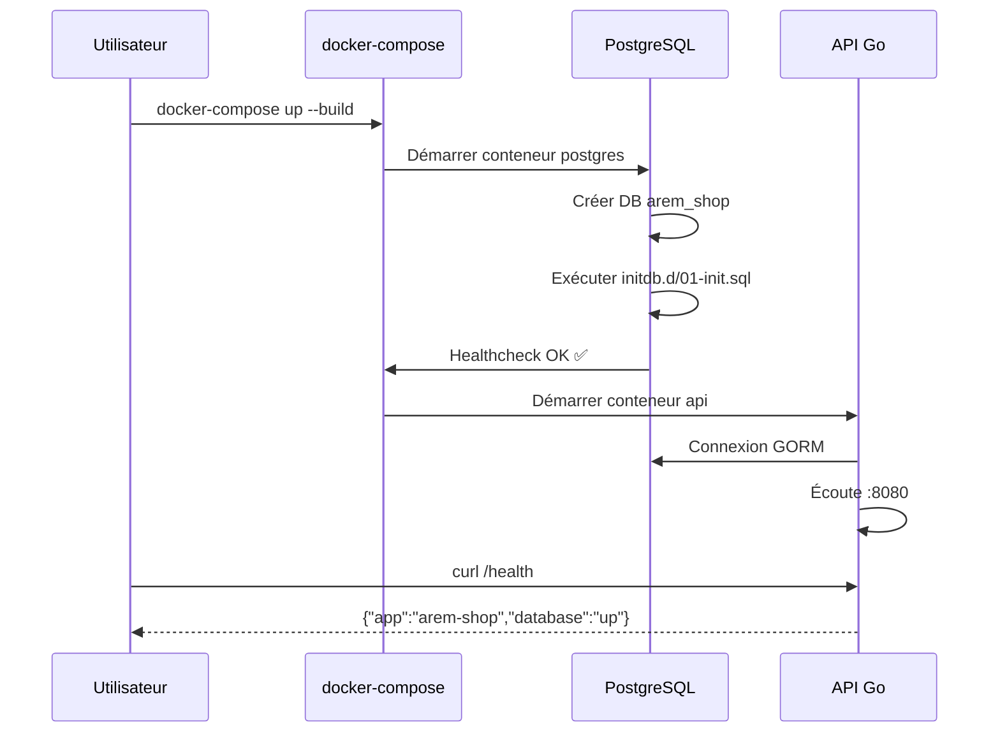
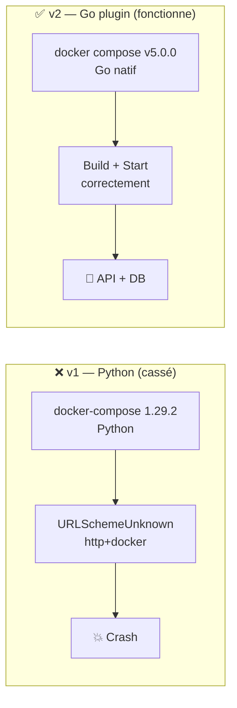
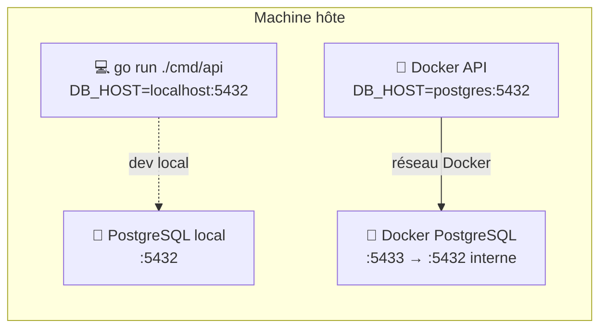

# Docker & Déploiement

## Infrastructure Docker



## Build multi-stage Dockerfile



## Cycle de démarrage



## Scripts de lancement

| Script | Usage | Description |
|--------|-------|-------------|
| `scripts/docker-start.sh` | `bash scripts/docker-start.sh` | Vérifie Docker, crée `.env` si absent, build & lance tout |
| `scripts/docker-stop.sh` | `bash scripts/docker-stop.sh` | Arrête les conteneurs (données DB conservées) |
| `scripts/docker-stop.sh -v` | `bash scripts/docker-stop.sh -v` | Arrête + supprime le volume DB |
| `scripts/docker-logs.sh` | `bash scripts/docker-logs.sh` | Suit les logs de tous les services |
| `scripts/docker-logs.sh api` | `bash scripts/docker-logs.sh api` | Suit les logs de l'API uniquement |

Ou via le **Makefile** :

| Commande | Equivalent |
|----------|------------|
| `make docker-up` | `bash scripts/docker-start.sh` |
| `make docker-up-detach` | `bash scripts/docker-start.sh -d` |
| `make docker-down` | `bash scripts/docker-stop.sh` |
| `make docker-clean` | `bash scripts/docker-stop.sh --volumes` |
| `make docker-logs` | `bash scripts/docker-logs.sh` |

## Commandes Docker directes

| Commande | Description |
|----------|-------------|
| `cp .env.example .env` | Créer la config locale |
| `docker-compose up --build` | Build + démarrer tout |
| `docker-compose up -d` | Démarrer en arrière-plan |
| `docker-compose logs -f api` | Suivre les logs API |
| `docker-compose logs -f postgres` | Suivre les logs DB |
| `docker-compose down` | Arrêter les conteneurs |
| `docker-compose down -v` | Arrêter + supprimer le volume DB |
| `docker-compose build --no-cache` | Rebuild sans cache |

## Troubleshooting

### `docker-compose` v1 vs `docker compose` v2



**Symptôme** : `URLSchemeUnknown: Not supported URL scheme http+docker`

**Cause** : Incompatibilité entre `docker-compose` v1 (Python) et les versions récentes de `requests`/`urllib3`.

**Solution** : Nos scripts détectent automatiquement `docker compose` v2 en priorité. Si l'erreur persiste :

```bash
# Vérifier que v2 est disponible
docker compose version

# Utiliser directement v2
docker compose up --build
```

### Conflit de port PostgreSQL (5432)



**Symptôme** : `address already in use` sur le port 5432

**Cause** : Un PostgreSQL local tourne déjà sur le port 5432.

**Solution** : Le `docker-compose.yml` expose la DB Docker sur le port **5433** par défaut. L'API Docker communique en interne sur le port 5432 via le réseau Docker — aucun conflit.

## Fichiers impliqués

- `Dockerfile` → build multi-stage Go
- `docker-compose.yml` → orchestration api + postgres
- `.env.example` → template de configuration (versionné)
- `.env` → configuration effective (gitignored, **jamais pushé**)
- `migrations/000001_init.up.sql` → schéma appliqué automatiquement au premier démarrage

## Suite

- [[00-Plan-Explication]]
