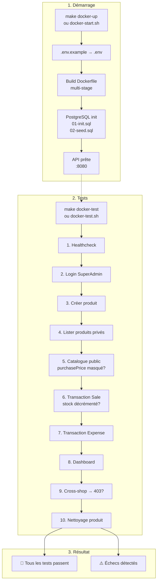
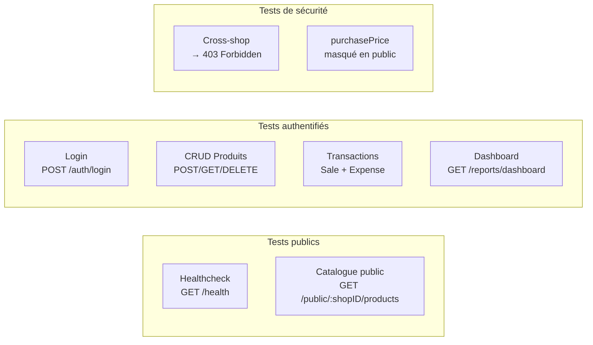

# Guide de test Docker — Arem-Shop

## Schéma du flux de test



## Prérequis

- Docker installé et démon lancé
- `jq` installé (`sudo apt install jq`)
- Aucune installation de Go ou PostgreSQL requise

## Étape par étape

### 1 — Démarrer les conteneurs

```bash
make docker-up
# ou
bash scripts/docker-start.sh
```

Le script :
1. Crée `.env` depuis `.env.example` si absent
2. Build l'image Docker de l'API
3. Démarre PostgreSQL + applique migrations + seed automatiquement
4. Démarre l'API une fois la DB prête

Attendre les logs :
```
arem-shop-api  | [GIN-debug] Listening and serving HTTP on :8080
```

### 2 — Lancer les tests (dans un autre terminal)

```bash
make docker-test
# ou
bash scripts/docker-test.sh
```

### 3 — Résultat attendu

```
══════════════════════════════════════════════════════════
  Arem-Shop — Test complet API Docker
  http://localhost:8080
══════════════════════════════════════════════════════════

1) Healthcheck
  ✅ GET /health → 200

2) Login SuperAdmin
  ✅ Token JWT obtenu (eyJhbGciOi...)

3) Créer un produit (SuperAdmin)
  ✅ Produit créé avec ID (uuid)

4) Lister les produits privés
  ✅ GET /products → 200

5) Catalogue public
  ✅ GET /public/:shopID/products → 200
  ✅ purchasePrice masqué dans le catalogue public

6) Transaction Sale (stock: 10 → 8)
  ✅ POST /transactions (Sale) → 201

7) Transaction Expense
  ✅ POST /transactions (Expense) → 201

8) Dashboard SuperAdmin
  ✅ GET /reports/dashboard → 200

9) Sécurité : tentative cross-shop
  ✅ POST /auth/register cross-shop → 403

10) Nettoyage : supprimer le produit test
  ✅ DELETE /products/:id → 200

══════════════════════════════════════════════════════════
  🎉 TOUS LES TESTS PASSENT : 11/11
══════════════════════════════════════════════════════════
```

### 4 — Arrêter

```bash
make docker-down        # Garder les données DB
make docker-clean       # Supprimer aussi le volume DB
```

## Détail des 10 tests



| # | Test | Endpoint | Attendu | Vérifie |
|---|------|----------|---------|---------|
| 1 | Healthcheck | `GET /health` | 200 | API + DB connectées |
| 2 | Login | `POST /auth/login` | Token JWT | Authentification OK |
| 3 | Créer produit | `POST /products` | ID produit | CRUD fonctionnel |
| 4 | Lister produits | `GET /products` | 200 | Isolation shop |
| 5 | Catalogue public | `GET /public/:shopID/products` | 200 + pas de purchasePrice | Sécurité données |
| 6 | Sale | `POST /transactions` | 201 | Décrément stock atomique |
| 7 | Expense | `POST /transactions` | 201 | Transaction sans produit |
| 8 | Dashboard | `GET /reports/dashboard` | 200 | Agrégation financière |
| 9 | Cross-shop | `POST /auth/register` | 403 | Isolation multi-tenant |
| 10 | Delete | `DELETE /products/:id` | 200 | Nettoyage |

## Comptes de test

| Rôle | Email | Mot de passe | Shop ID |
|------|-------|-------------|---------|
| SuperAdmin | `owner@shopdemo.com` | `ChangeMe123!` | `11111111-1111-1111-1111-111111111111` |

## Fichiers impliqués

- `migrations/000002_seed_demo.sql` → Seed du Shop Demo + SuperAdmin
- `scripts/docker-test.sh` → Script de test automatisé (10 tests)
- `docker-compose.yml` → Monte les migrations + seed dans initdb.d

## Suite

- [[07-Docker-Deployment]]
- [[00-Plan-Explication]]
