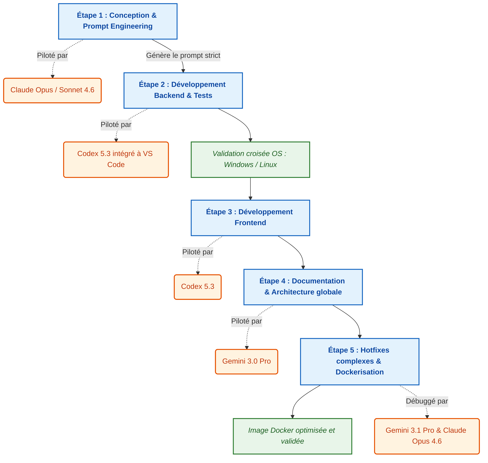
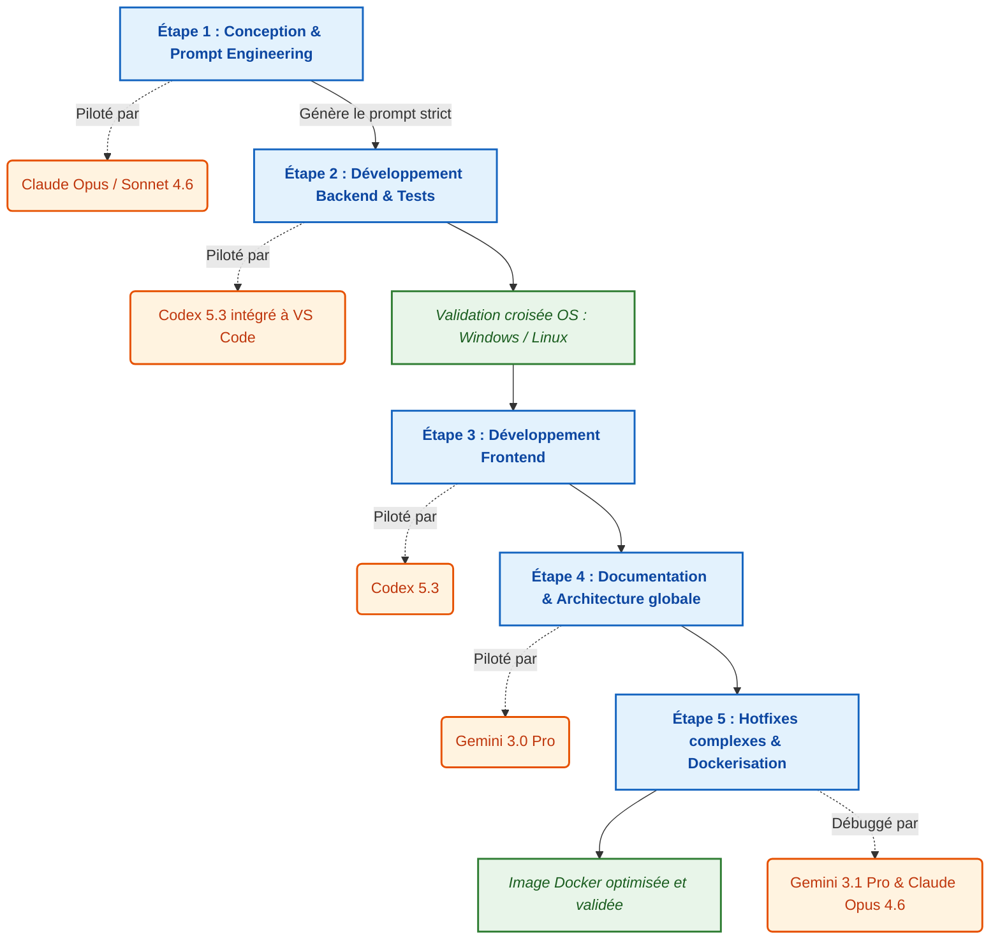
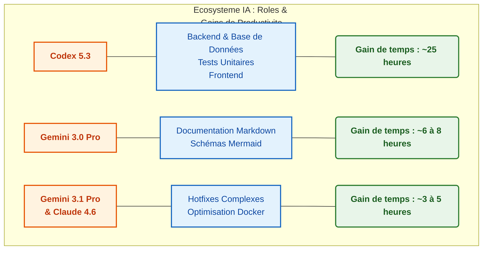
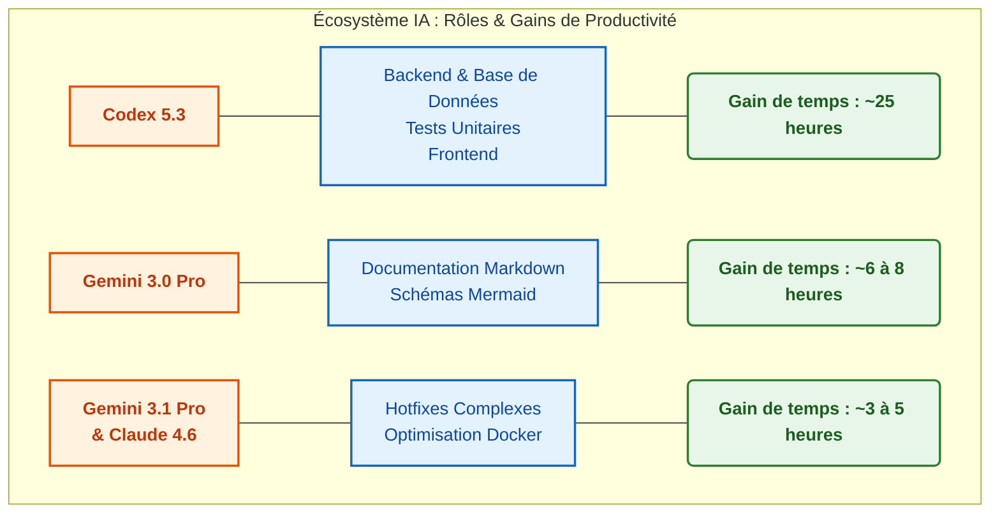

# Workflow d'Intégration des Intelligences Artificielles

**Membres du groupe :**
* Alex-Gabriel CHITU
* Mattew VENET
* Enzo Toni REALE
* Rabah Amir DEBBAH

Ce document détaille la méthodologie hybride adoptée par l'équipe pour la conception, le développement, la documentation et le déploiement du projet, en utilisant une synergie de plusieurs Intelligences Artificielles (IA).

## 1. Schéma Global du Workflow

Le développement s'est déroulé en 5 phases séquentielles. Chaque phase a été pilotée par l'IA la plus performante dans son domaine spécifique.

*(Voir l'image HD : `arem-doc/images/workflow-hd.png`)*

## 2. Répartition des Rôles IA et Temps Gagné

Aucune IA n'étant parfaite pour toutes les tâches, nous avons utilisé un écosystème d'IA afin de pallier les faiblesses individuelles de chacune (exemple : manque de contexte de Codex, compensé par Gemini). L'automatisation des tâches rébarbatives (Boilerplate, écriture des tests, formatage textuel) a permis au groupe de se concentrer sur l'architecture, la liaison Front/Back, l'orchestration des données et les tests croisés.

### Résumé Tabulaire classique

| Intelligence Artificielle | Rôle et périmètre d'action | Gain de temps estimé |
| :--- | :--- | :--- |
| **Codex 5.3 (VS Code)** | Création des interfaces (Front), logique (Back) et tests unitaires | **~ 25 heures** *(~15h Back, ~10h Front)* |
| **Gemini 3.0 Pro** | Documentation Markdown, intégration des schémas Mermaid pour Obsidian | **~ 6 à 8 heures** |
| **Claude 4.6 & Gemini 3.1 Pro** | Débogage lourd multi-OS, hotfixes complexes et optimisation Docker | **~ 3 à 5 heures** |
| **Total Estimé** | Gain sur l'ensemble du cycle de vie du projet | **Entre 34 et 38 heures** |

---

### Résumé sous forme de Schéma Diagrammatique 

*(Voir l'image HD : `arem-doc/images/repartition-hd.png`)*

## 3. Détail des Étapes de Développement

1. **Prompt Engineering (Init) :** Utilisation de Claude 4.6 pour rédiger des consignes de code d'une rigueur absolue en préparation du terrain.
2. **Setup & Backend :** Codex 5.3 prend le relais dans VS Code pour générer le code source étape par étape. Validation manuelle du backend via l'exécution des tests générés, sur des machines **Windows** et **Linux**.
3. **Frontend :** Génération des interfaces et connexion aux routes de l'API par Codex 5.3. Étant techniquement simple, le but a surtout été de relier le Back et le Front.
4. **Documentation (Obsidian) :** L'intégralité du code source validé a été fourni à Gemini 3.0 Pro. Ce denier, grâce à sa très large fenêtre de contexte, a processé le projet complet pour générer la documentation enrichie expliquant l'architecture.
5. **Optimisation finale & Conteneurisation :** Des conflits systèmes (ex: Podman vs Docker sur certains ordinateurs) ont entraîné des bugs. Gemini 3.1 et Claude 4.6 ont été utilisés de concert pour rivaliser d'ingéniosité afin d'alléger les conteneurs (Dockerfile) et résoudre les blocages multi-plateformes.

