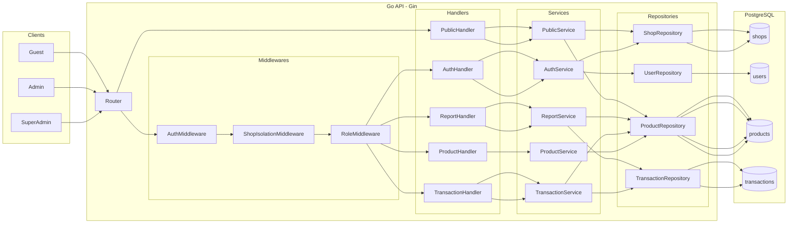

# Architecture globale

```mermaid
flowchart LR
    subgraph Clients
        SA[SuperAdmin]
        AD[Admin]
        GU[Guest]
    end

    subgraph API[Go API - Gin]
        RT[Router]

        subgraph MW[Middlewares]
            AM[AuthMiddleware]
            SM[ShopIsolationMiddleware]
            RM[RoleMiddleware]
        end

        subgraph H[Handlers]
            AH[AuthHandler]
            PH[ProductHandler]
            TH[TransactionHandler]
            RH[ReportHandler]
            UH[PublicHandler]
        end

        subgraph S[Services]
            AS[AuthService]
            PS[ProductService]
            TS[TransactionService]
            RS[ReportService]
            US[PublicService]
        end

        subgraph R[Repositories]
            UR[UserRepository]
            SR[ShopRepository]
            PR[ProductRepository]
            TR[TransactionRepository]
        end
    end

    subgraph DB[PostgreSQL]
        SH[(shops)]
        USR[(users)]
        PD[(products)]
        TX[(transactions)]
    end

    SA --> RT
    AD --> RT
    GU --> RT

    RT --> AM --> SM --> RM
    RM --> AH
    RM --> PH
    RM --> TH
    RM --> RH
    RT --> UH

    AH --> AS --> UR --> USR
    AH --> AS --> SR --> SH

    PH --> PS --> PR --> PD
    TH --> TS --> PR --> PD
    TH --> TS --> TR --> TX
    RH --> RS --> TR --> TX
    RH --> RS --> PR --> PD
    UH --> US --> SR --> SH
    UH --> US --> PR --> PD
```
