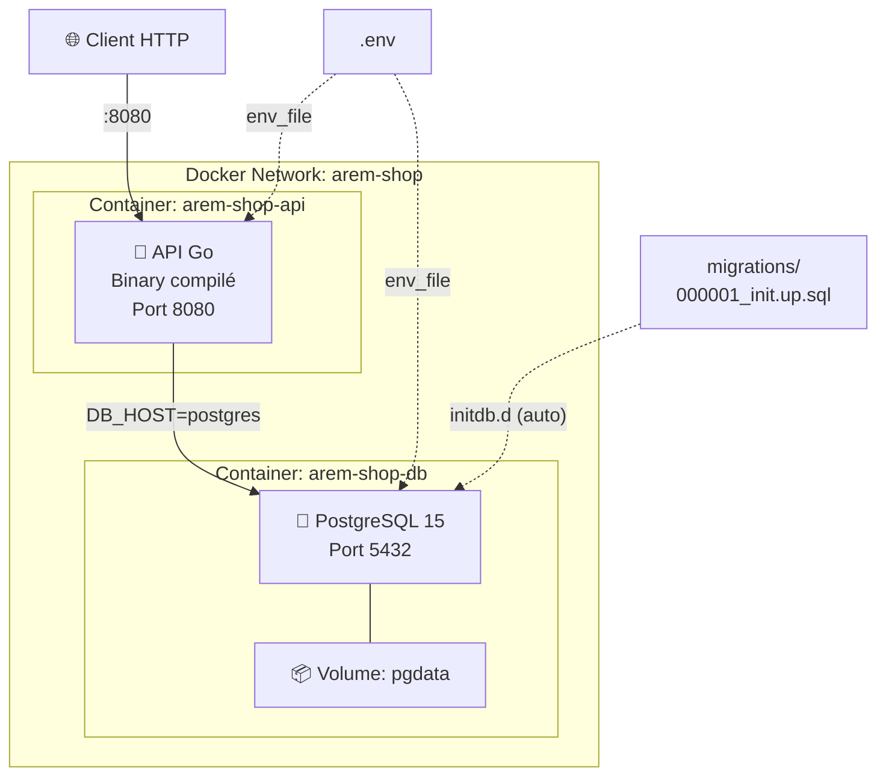

```mermaid
graph TB
    subgraph "Docker Network: arem-shop"
        subgraph "Container: arem-shop-api"
            API["🚀 API Go<br/>Binary compilé<br/>Port 8080"]
        end
        
        subgraph "Container: arem-shop-db"
            PG["🐘 PostgreSQL 15<br/>Port 5432"]
            VOL["📦 Volume: pgdata"]
        end
    end
    
    CLIENT["🌐 Client HTTP"] -->|":8080"| API
    API -->|"DB_HOST=postgres"| PG
    PG --- VOL
    
    ENV[".env"] -.->|env_file| API
    ENV -.->|env_file| PG
    MIG["migrations/<br/>000001_init.up.sql"] -.->|"initdb.d (auto)"| PG
```
