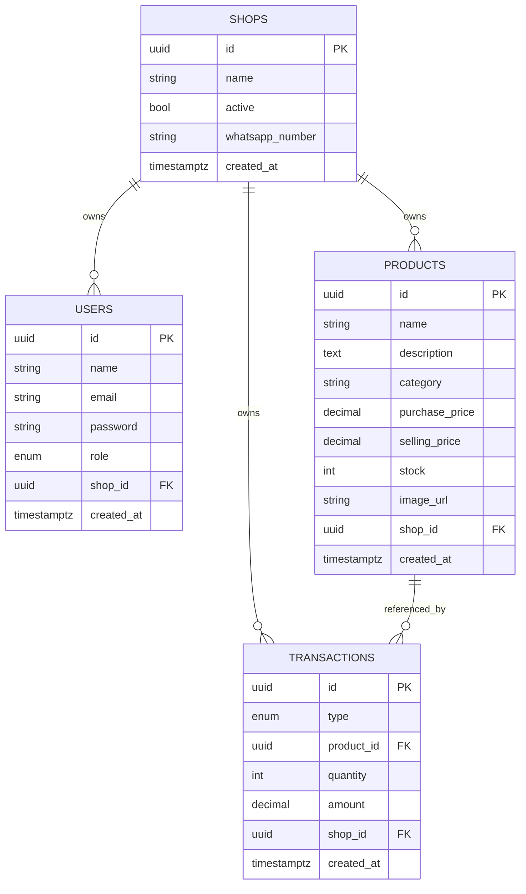

# ERD

```mermaid
erDiagram
    SHOPS ||--o{ USERS : owns
    SHOPS ||--o{ PRODUCTS : owns
    SHOPS ||--o{ TRANSACTIONS : owns
    PRODUCTS ||--o{ TRANSACTIONS : referenced_by

    SHOPS {
        uuid id PK
        string name
        bool active
        string whatsapp_number
        timestamptz created_at
    }

    USERS {
        uuid id PK
        string name
        string email
        string password
        enum role
        uuid shop_id FK
        timestamptz created_at
    }

    PRODUCTS {
        uuid id PK
        string name
        text description
        string category
        decimal purchase_price
        decimal selling_price
        int stock
        string image_url
        uuid shop_id FK
        timestamptz created_at
    }

    TRANSACTIONS {
        uuid id PK
        enum type
        uuid product_id FK
        int quantity
        decimal amount
        uuid shop_id FK
        timestamptz created_at
    }
```
