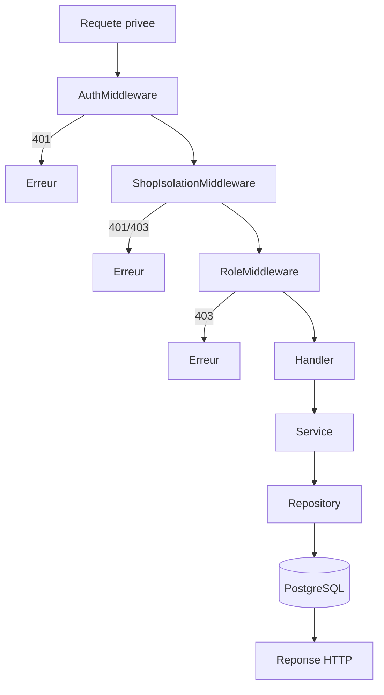

# Pipeline securite

```mermaid
flowchart TB
    REQ[Requete privee] --> AUTH[AuthMiddleware]
    AUTH -->|401| RESP1[Erreur]
    AUTH --> ISO[ShopIsolationMiddleware]
    ISO -->|401/403| RESP2[Erreur]
    ISO --> ROLE[RoleMiddleware]
    ROLE -->|403| RESP3[Erreur]
    ROLE --> HANDLER[Handler]
    HANDLER --> SERVICE[Service]
    SERVICE --> REPO[Repository]
    REPO --> DB[(PostgreSQL)]
    DB --> OK[Reponse HTTP]
```
