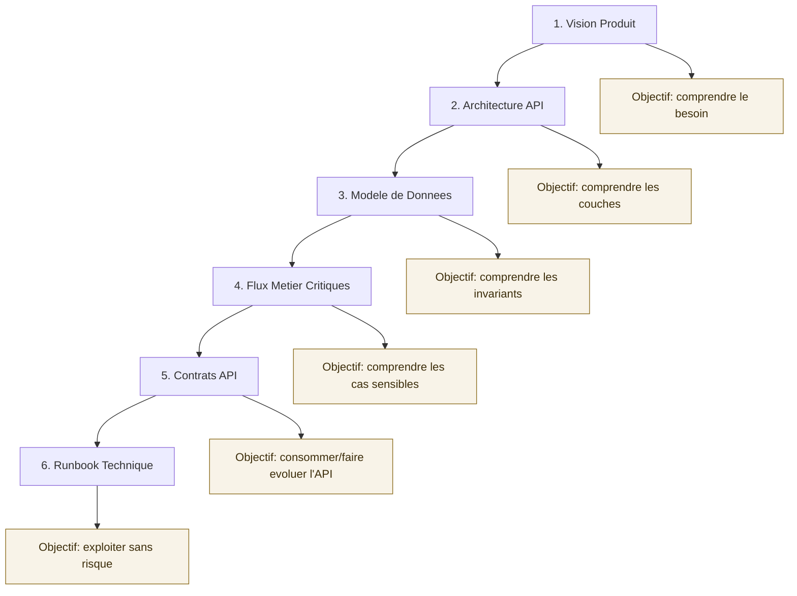

# Plan d'explication

```mermaid
flowchart TD
    A[1. Vision Produit] --> B[2. Architecture API]
    B --> C[3. Modele de Donnees]
    C --> D[4. Flux Metier Critiques]
    D --> E[5. Contrats API]
    E --> F[6. Runbook Technique]

    A1[Objectif: comprendre le besoin]:::note
    B1[Objectif: comprendre les couches]:::note
    C1[Objectif: comprendre les invariants]:::note
    D1[Objectif: comprendre les cas sensibles]:::note
    E1[Objectif: consommer/faire evoluer l'API]:::note
    F1[Objectif: exploiter sans risque]:::note

    A --> A1
    B --> B1
    C --> C1
    D --> D1
    E --> E1
    F --> F1

    classDef note fill:#f8f3e8,stroke:#8c6d1f,color:#3c2d0a;
```
