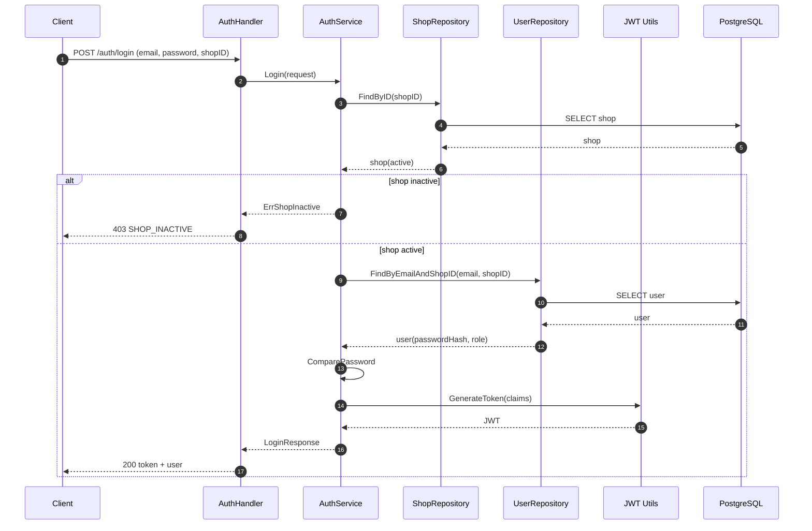

# Sequence login

```mermaid
sequenceDiagram
    autonumber
    participant C as Client
    participant H as AuthHandler
    participant S as AuthService
    participant SR as ShopRepository
    participant UR as UserRepository
    participant U as JWT Utils
    participant DB as PostgreSQL

    C->>H: POST /auth/login (email, password, shopID)
    H->>S: Login(request)
    S->>SR: FindByID(shopID)
    SR->>DB: SELECT shop
    DB-->>SR: shop
    SR-->>S: shop(active)

    alt shop inactive
        S-->>H: ErrShopInactive
        H-->>C: 403 SHOP_INACTIVE
    else shop active
        S->>UR: FindByEmailAndShopID(email, shopID)
        UR->>DB: SELECT user
        DB-->>UR: user
        UR-->>S: user(passwordHash, role)
        S->>S: ComparePassword
        S->>U: GenerateToken(claims)
        U-->>S: JWT
        S-->>H: LoginResponse
        H-->>C: 200 token + user
    end
```
