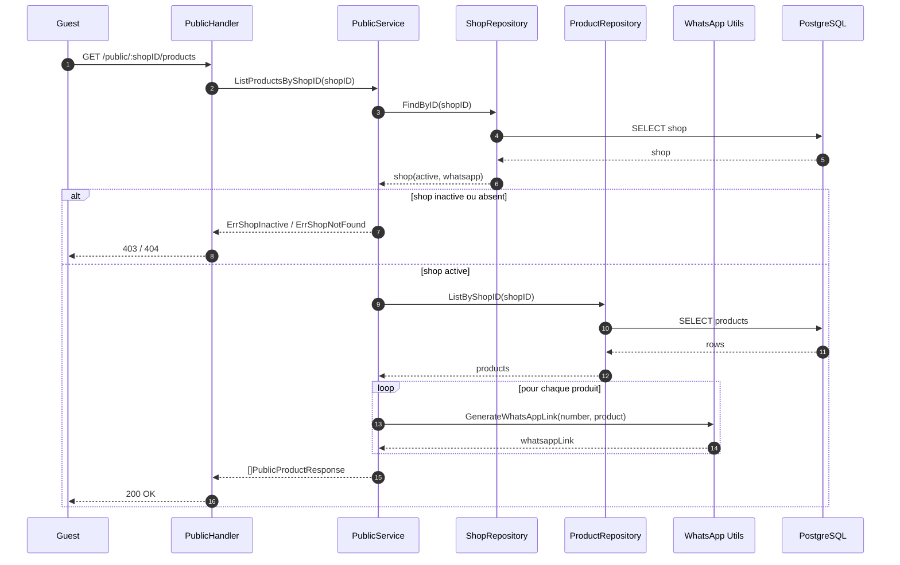

# Sequence public catalog

```mermaid
sequenceDiagram
    autonumber
    participant G as Guest
    participant H as PublicHandler
    participant S as PublicService
    participant SR as ShopRepository
    participant PR as ProductRepository
    participant WA as WhatsApp Utils
    participant DB as PostgreSQL

    G->>H: GET /public/:shopID/products
    H->>S: ListProductsByShopID(shopID)
    S->>SR: FindByID(shopID)
    SR->>DB: SELECT shop
    DB-->>SR: shop
    SR-->>S: shop(active, whatsapp)

    alt shop inactive ou absent
        S-->>H: ErrShopInactive / ErrShopNotFound
        H-->>G: 403 / 404
    else shop active
        S->>PR: ListByShopID(shopID)
        PR->>DB: SELECT products
        DB-->>PR: rows
        PR-->>S: products
        loop pour chaque produit
            S->>WA: GenerateWhatsAppLink(number, product)
            WA-->>S: whatsappLink
        end
        S-->>H: []PublicProductResponse
        H-->>G: 200 OK
    end
```
