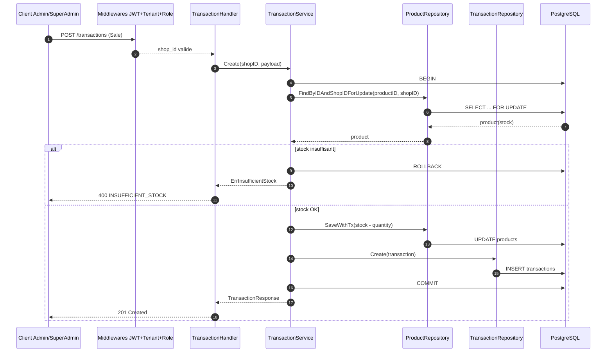

# Sequence transaction sale

```mermaid
sequenceDiagram
    autonumber
    participant C as Client Admin/SuperAdmin
    participant M as Middlewares JWT+Tenant+Role
    participant H as TransactionHandler
    participant S as TransactionService
    participant PR as ProductRepository
    participant TR as TransactionRepository
    participant DB as PostgreSQL

    C->>M: POST /transactions (Sale)
    M-->>H: shop_id valide
    H->>S: Create(shopID, payload)
    S->>DB: BEGIN
    S->>PR: FindByIDAndShopIDForUpdate(productID, shopID)
    PR->>DB: SELECT ... FOR UPDATE
    DB-->>PR: product(stock)
    PR-->>S: product

    alt stock insuffisant
        S->>DB: ROLLBACK
        S-->>H: ErrInsufficientStock
        H-->>C: 400 INSUFFICIENT_STOCK
    else stock OK
        S->>PR: SaveWithTx(stock - quantity)
        PR->>DB: UPDATE products
        S->>TR: Create(transaction)
        TR->>DB: INSERT transactions
        S->>DB: COMMIT
        S-->>H: TransactionResponse
        H-->>C: 201 Created
    end
```
