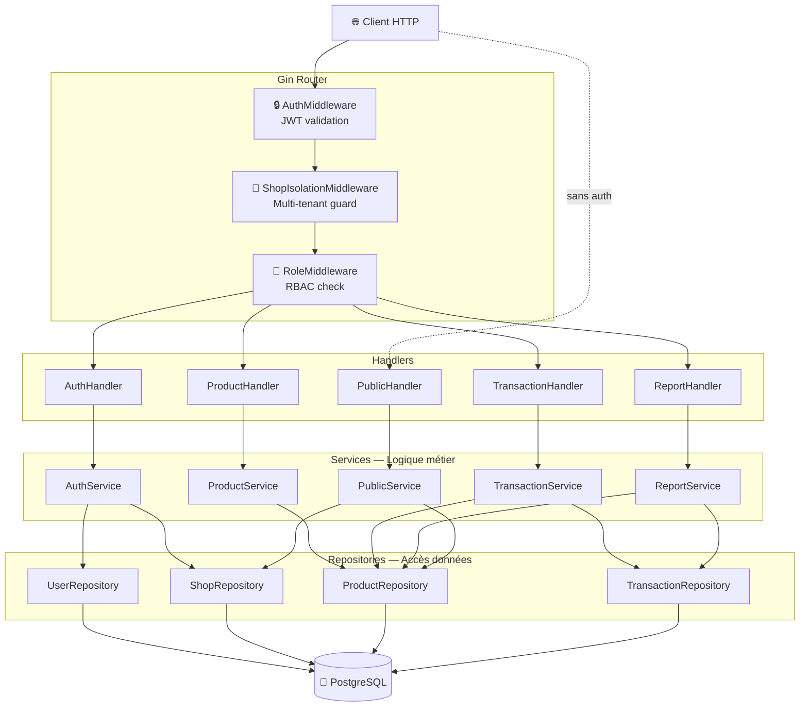
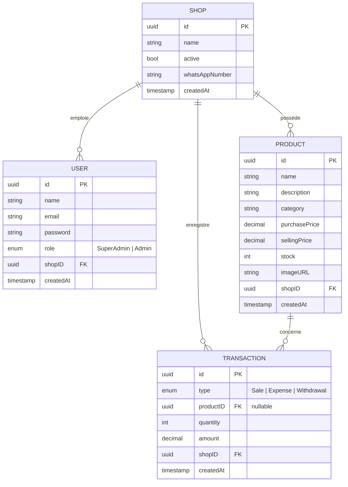
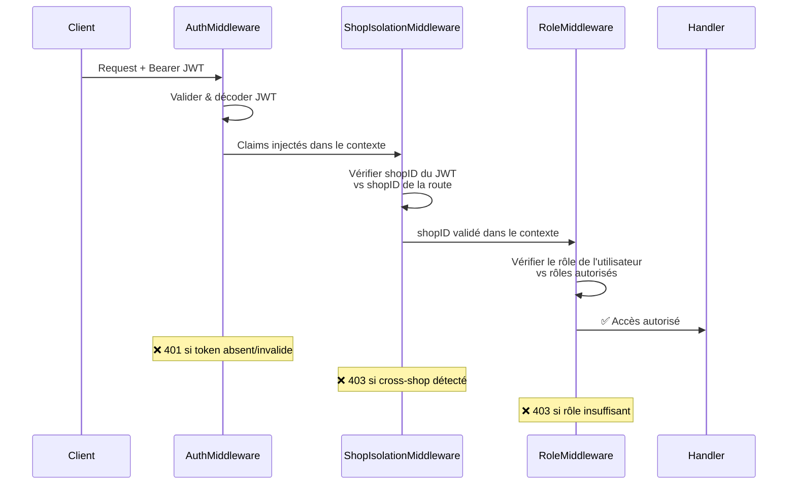

# Arem-Shop — Architecture du Projet

**API REST multi-tenant** de gestion de boutique (produits, transactions, reporting), écrite en **Go** avec le framework **Gin**.

---

## Arborescence

```
arem-shop/
├── cmd/
│   └── api/
│       └── main.go              ← Point d'entrée, DI & routing
├── config/
│   └── .env                     ← Variables d'environnement (gitignored)
├── internal/
│   ├── config/
│   │   └── config.go            ← Chargement de la configuration (.env → struct)
│   ├── database/
│   │   └── postgres.go          ← Connexion PostgreSQL via GORM
│   ├── models/
│   │   ├── shop.go              ← Entité Shop (tenant)
│   │   ├── user.go              ← Entité User + rôles
│   │   ├── product.go           ← Entité Product
│   │   └── transaction.go       ← Entité Transaction (Sale/Expense/Withdrawal)
│   ├── dto/
│   │   ├── auth_dto.go          ← DTOs d'authentification
│   │   ├── product_dto.go       ← DTOs produit (create/update/response)
│   │   ├── public_product_dto.go← DTOs vitrine publique
│   │   ├── report_dto.go        ← DTOs dashboard
│   │   ├── shop_dto.go          ← DTOs mise à jour boutique
│   │   └── transaction_dto.go   ← DTOs transaction
│   ├── repository/
│   │   ├── user_repository.go
│   │   ├── shop_repository.go
│   │   ├── product_repository.go
│   │   └── transaction_repository.go
│   ├── services/
│   │   ├── auth_service.go      ← Inscription & login
│   │   ├── product_service.go   ← CRUD produits
│   │   ├── public_service.go    ← Catalogue public
│   │   ├── shop_service.go      ← Mise à jour boutique (nom, WhatsApp)
│   │   ├── transaction_service.go ← Ventes, dépenses, retraits
│   │   └── report_service.go    ← Dashboard financier
│   ├── handlers/
│   │   ├── auth_handler.go
│   │   ├── product_handler.go
│   │   ├── public_handler.go
│   │   ├── shop_handler.go      ← Mise à jour boutique
│   │   ├── transaction_handler.go
│   │   └── report_handler.go
│   ├── middleware/
│   │   ├── auth_middleware.go           ← Validation JWT
│   │   ├── role_middleware.go           ← Contrôle RBAC
│   │   └── shop_isolation_middleware.go ← Isolation multi-tenant
│   └── utils/
│       ├── jwt.go               ← Génération & parsing JWT
│       ├── password.go          ← Hashing bcrypt
│       ├── response.go          ← Helpers réponse JSON
│       └── whatsapp.go          ← Utilitaire WhatsApp
├── migrations/
│   ├── 000001_init.up.sql       ← Migration initiale
│   └── 000001_init.down.sql     ← Rollback
├── scripts/
│   └── first_run.sh             ← Script de premier lancement
├── docs/
│   └── openapi.yaml             ← Spécification OpenAPI
├── go.mod
├── go.sum
├── Makefile
└── .gitignore
```

---

## Architecture en Couches



---

## Stack Technique

| Composant       | Technologie                        |
|-----------------|------------------------------------|
| Langage         | **Go 1.18**                        |
| Framework HTTP  | **Gin v1.8**                       |
| ORM             | **GORM v1.23** + driver PostgreSQL |
| Base de données | **PostgreSQL**                     |
| Auth            | **JWT** (golang-jwt/jwt/v4)        |
| Hashing         | **bcrypt** (golang.org/x/crypto)   |
| Décimaux        | **shopspring/decimal**             |
| UUID            | **google/uuid**                    |
| Config          | **godotenv**                       |

---

## Modèle de Données (ERD)



---

## Endpoints API

### Publics (sans authentification)
| Méthode | Route                        | Description            |
|---------|------------------------------|------------------------|
| `GET`   | `/health`                    | Health check           |
| `POST`  | `/auth/login`                | Connexion (retourne JWT) |
| `GET`   | `/public/:shopID/products`   | Catalogue public       |
| `GET`   | `/uploads/*`                 | Fichiers images statiques|

### Protégés — SuperAdmin + Admin
| Méthode  | Route              | Description            |
|----------|--------------------|------------------------|
| `GET`    | `/products`        | Lister les produits    |
| `POST`   | `/products`        | Créer un produit       |
| `PUT`    | `/products/:id`    | Modifier un produit    |
| `DELETE` | `/products/:id`    | Supprimer un produit   |
| `POST`   | `/transactions`    | Créer une transaction  |
| `POST`   | `/upload`          | Upload d'une image     |

### Protégés — SuperAdmin uniquement
| Méthode | Route                 | Description                |
|---------|-----------------------|----------------------------|
| `POST`  | `/auth/register`      | Enregistrer un utilisateur |
| `PUT`   | `/shop`               | Modifier nom et WhatsApp   |
| `GET`   | `/reports/dashboard`  | Dashboard financier        |

---

## Sécurité & Multi-Tenancy



### Principes clés
- **JWT** : Chaque token contient `userID`, `shopID`, `role`
- **Isolation multi-tenant** : Un utilisateur ne peut accéder qu'aux données de son shop
- **RBAC** : Deux rôles — `SuperAdmin` (gestion complète) et `Admin` (opérations courantes)
- **Protection des données sensibles** : Le `purchasePrice` n'est visible que par les `SuperAdmin`

---

## Injection de Dépendances

Le point d'entrée `main.go` assemble manuellement les couches (**pas de framework DI**) :

```
Config → Database → Repositories → Services → Handlers → Router
```

Cela garantit un **couplage faible** et une **testabilité maximale** — les services utilisent des **interfaces** pour leurs dépendances repository.

---

## Transactions Base de Données

Les ventes (`TransactionSale`) utilisent une **transaction SQL** avec un verrou pessimiste (`SELECT ... FOR UPDATE`) pour :
1. Verrouiller le produit concerné
2. Vérifier le stock disponible
3. Décrémenter le stock
4. Créer la transaction

Cela empêche les **race conditions** sur le stock.
