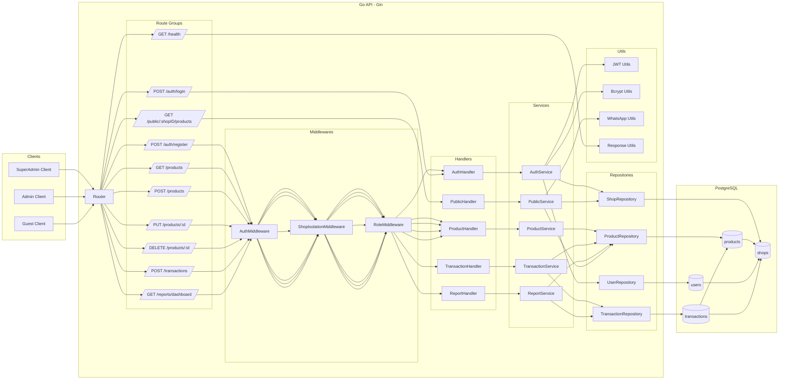
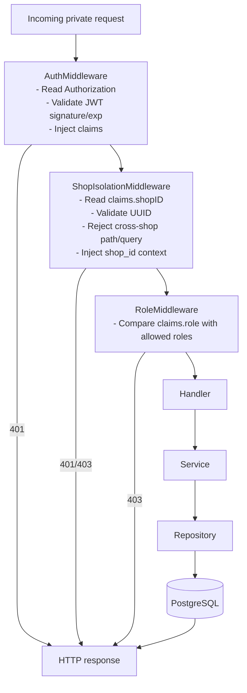
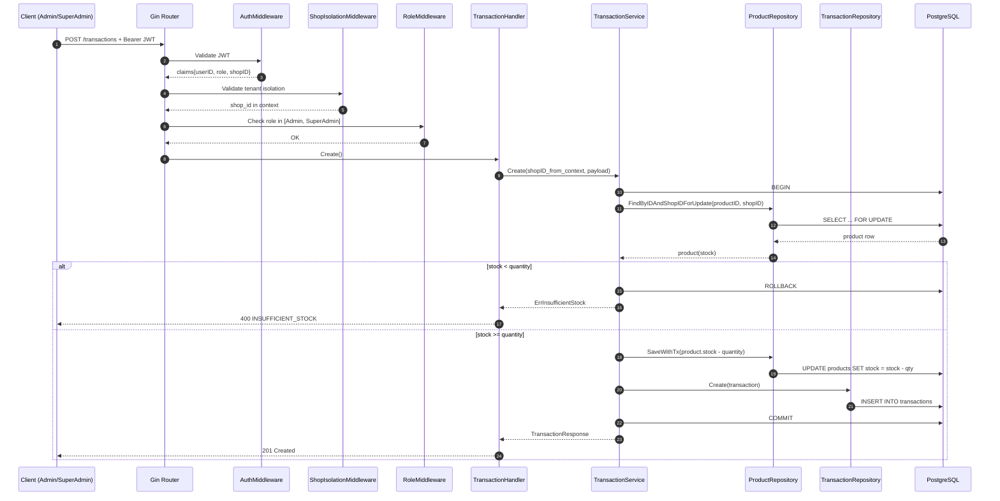
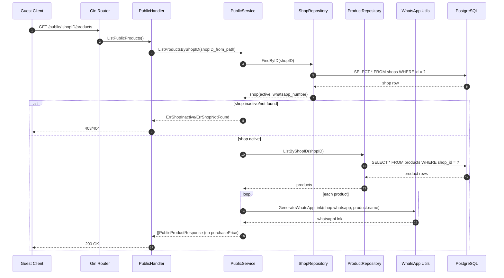
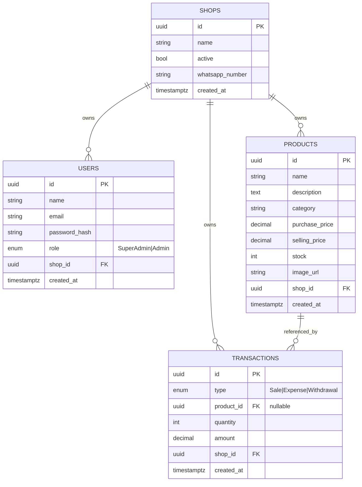
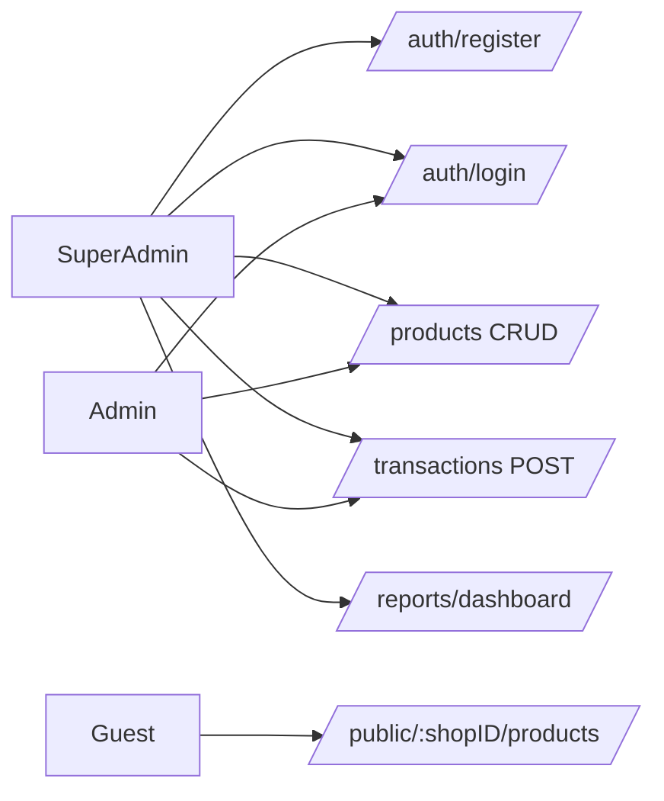

# Architecture Mermaid (HD)

Ce document donne une vue complete du fonctionnement de l'API multi-tenant.

## 1) Vue globale de l'architecture

## 2) Pipeline de securite des routes privees

## 3) Sequence detaillee: POST /transactions (type=Sale)

## 4) Sequence detaillee: GET /public/:shopID/products

## 5) Modele de donnees (ERD)

## 6) Matrice d'acces

## Notes importantes

- L'isolation multi-tenant est enforcee au niveau middleware + repository (filtre `shop_id`).
- Les routes publiques sont isolees par `:shopID` et ne renvoient jamais `purchasePrice`.
- Les ventes decremente le stock de facon atomique dans une transaction SQL.
