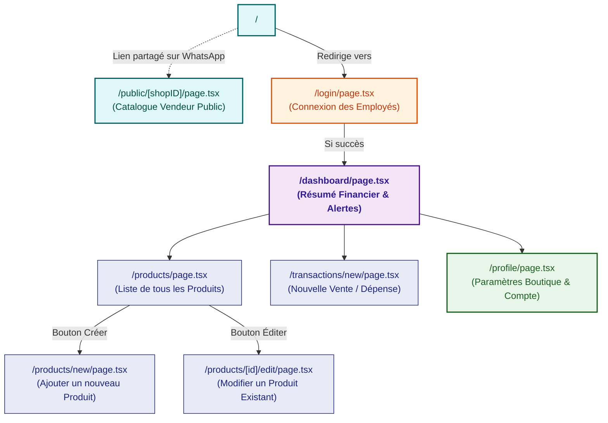

# Scénario et Arborescence de l'Application

Ce fichier décrit la structure des pages du frontend (Next.js) et le rôle de chacune selon le parcours de l'utilisateur.

## Détail des pages :

1. **`/` (Racine)** : Un simple point d'entrée qui redirige automatiquement l'utilisateur vers son tableau de bord s'il est connecté, ou vers `/login` sinon.
2. **`/login`** : La page permettant la connexion des *Admins* ou *SuperAdmins* à leur boutique respective.
3. **`/dashboard`** : Le cœur de l'application sécurisée. Il affiche les métriques clés (chiffre d'affaires, dépenses, bénéfices) et alerte sur les ruptures de stock.
4. **`/products`** : Un tableau affichant l'intégralité de l'inventaire du magasin (prix, stock, catégorie).
5. **`/products/new`** & **`/products/[id]/edit`** : Les formulaires (avec upload d'image local) pour ajouter ou mettre à jour un produit de l'inventaire.
6. **`/transactions/new`** : Le point de vente. C'est ici que l'employé déclare une *Vente* (qui réduit le stock d'un produit) ou une *Dépense / Retrait* d'argent de la caisse.
7. **`/profile`** : La page de profil SuperAdmin. Permet de renommer la boutique et de modifier le numéro WhatsApp utilisé pour les liens de contact sur la vitrine publique.
8. **`/public/[shopID]`** : La vitrine orientée client. Elle est générée automatiquement et permet aux visiteurs de voir le catalogue des produits et de contacter le vendeur via un bouton WhatsApp, sans avoir besoin d'un compte.
