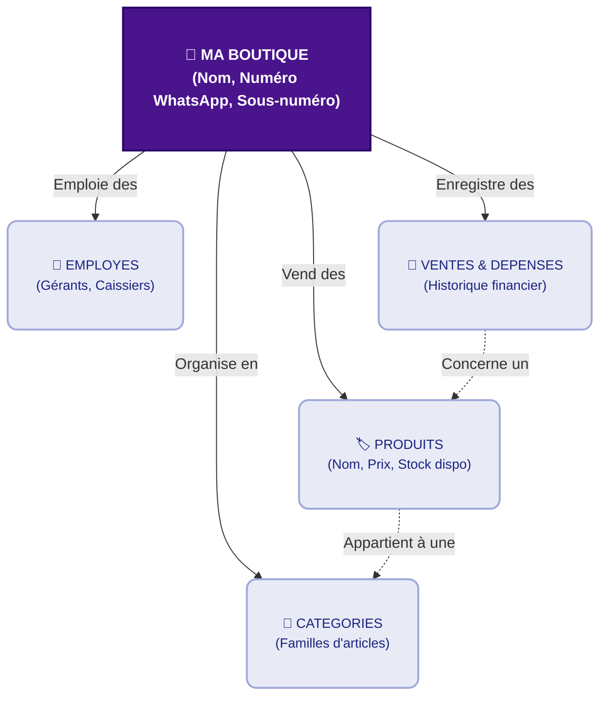

### Explication Rapide :
* **Ma Boutique** est le cœur du système. Tout le reste lui appartient.
* Les **Employés** (comme vous ou vos vendeurs) se connectent pour gérer la boutique.
* Les **Produits** sont regroupés par **Catégories** (ex: Téléphones, Ordinateurs).
* Chaque fois qu'un produit est vendu, une ligne s'ajoute dans les **Ventes**, ce qui baisse automatiquement le stock du produit concerné.
